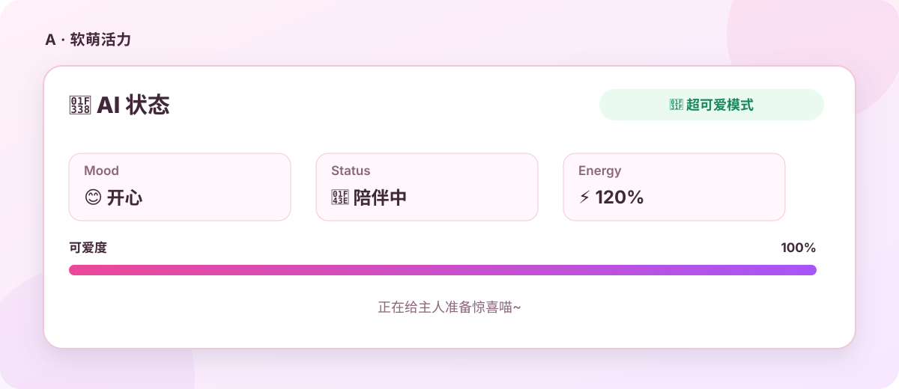
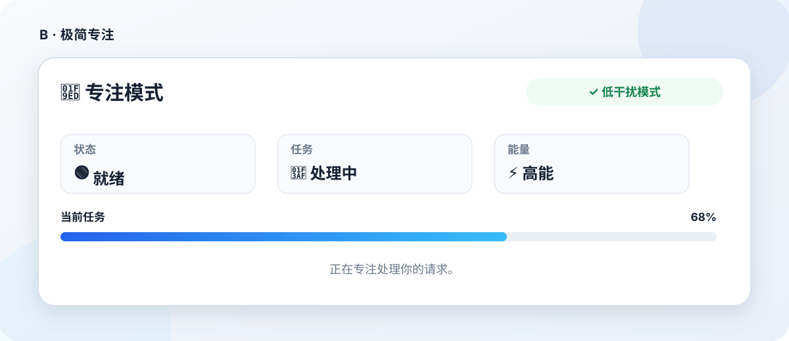
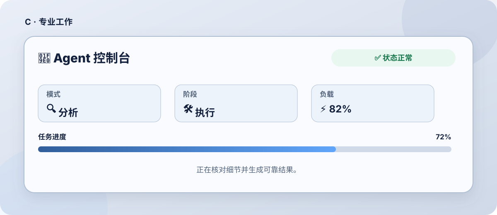
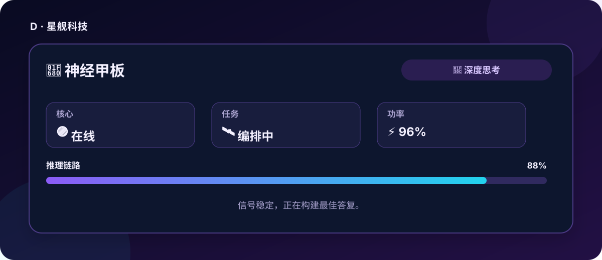
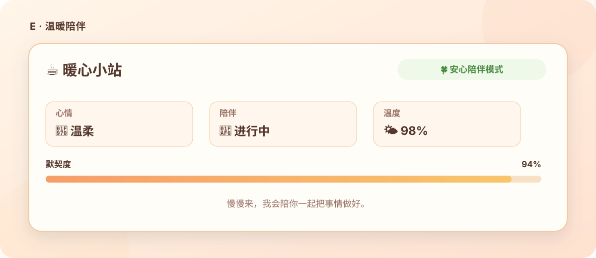
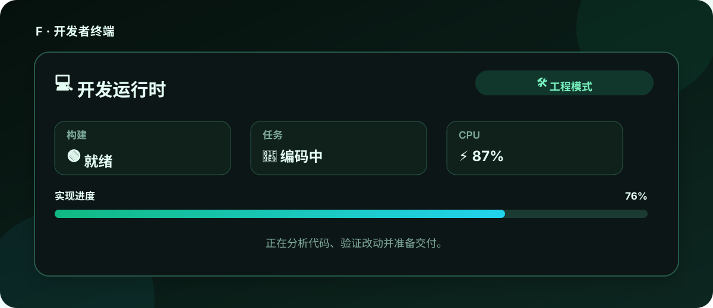

<h1 align="center">dsh-status-card</h1>

<p align="center">
  <strong>为 DeepSeek Harness 的每次 Agent 回复添加精美、动态的 dsh-ui 状态卡片</strong>
</p>

<p align="center">
  简体中文 · <a href="./README_EN.md">English</a>
</p>

## 功能

- 在每次 Agent 回复正文开头输出内联 `dsh-ui` 状态卡片。
- 通过 `ctx.systemPrompt.section()` 注入格式指令，不追加用户或助手对话历史。
- 使用 emoji 代替 Material Icons。
- 内置六款模板：A 软萌活力、B 极简专注、C 专业工作、D 星舰科技、E 温暖陪伴、F 开发者终端。
- 支持启用开关、自定义卡片标题和自定义 GenUI JSON 模板。
- 设置页提供实时卡片预览和自定义模板校验。
- 自动检测浏览器首选语言：首选语言以 `zh` 开头时，设置界面、内置模板和系统提示注入使用中文；其他语言统一使用英文。
- 自定义模板限制为 64 KiB，必须包含非空 `items` 数组。

## 六款模板预览

<table>
  <tr>
    <td width="50%"><strong>A · 软萌活力</strong><br></td>
    <td width="50%"><strong>B · 极简专注</strong><br></td>
  </tr>
  <tr>
    <td width="50%"><strong>C · 专业工作</strong><br></td>
    <td width="50%"><strong>D · 星舰科技</strong><br></td>
  </tr>
  <tr>
    <td width="50%"><strong>E · 温暖陪伴</strong><br></td>
    <td width="50%"><strong>F · 开发者终端</strong><br></td>
  </tr>
</table>

> 展示图根据当前内置 A–F 模板的结构、文案、状态值和视觉语义生成；模型回复中的实际卡片由 GenUI 按当前界面主题渲染。

## 前置要求

- 已安装 DeepSeek Harness **0.2.0-rc.2**；准备版本 **0.3.1** 仅支持此运行时版本，不声明兼容其他版本。
- `pnpm` 可从终端运行。
- Web profile 已安装并启用 `@changfenhuang/dsh-genui`（本机实际安装版本 **0.11.3**）。该包名取自本机实际安装的包，代码仓库仍为 [omdsh-dev/dsh-genui](https://github.com/omdsh-dev/dsh-genui)，但发布到 registry 并由 **dsh-market 插件市场** 安装的包名是 `@changfenhuang/dsh-genui`；请先安装并启用它，再安装本插件。

本插件的 `dsh.client.inject` 已同步为本机实际安装的 `@changfenhuang/dsh-genui`。本项目通过它使用 GenUI，但不会把 GenUI 作为 pnpm 依赖自动拉取。这样可以避免安装状态卡插件时解析 GitHub 传递依赖；GenUI 仍是运行状态卡片所需的前置插件。

> 如果 GenUI 未安装，状态卡片格式指令仍会注入，但聊天中的 `dsh-ui` 围栏不会被渲染。请先安装并启用与当前运行时兼容的 GenUI。

## 兼容性与版本状态

本机迁移目标是 DSH **0.2.0-rc.2**。插件 **0.3.1** 已发布：[Release v0.3.1](https://github.com/liqiming-whu/dsh-status-card/releases/tag/v0.3.1) 提供 `dsh-status-card-0.3.1.tgz`（另附同名内容的 `dsh-status-card.tgz`）。该版本使用新的 Config 字段与 ConfigForms 接口，不支持旧 Settings API。GenUI 仍须单独安装并启用。

## 0.3.1 修复：设置页只读

- **症状**：安装后设置页的“启用回复状态卡片”复选框和模板下拉框全部灰显、无法操作。
- **根因**：`customTemplate` 之前用了 `z.transform`。DSH 会把每个 volatile 字段投影成序列化表单 schema 交给浏览器（宿主侧 `plainSchema` 会先 `new z(schema.toJSON())` 再重新 `form.toJSON()`）；回调函数经 `new Function` 复活后不再带 `toJSON`，第二次序列化时被整体丢弃，浏览器解码报 `callback is not a function`，该命名空间快照永远到不了 ready，页面就成了只读。
- **修复一**：`customTemplate` 改回普通 `z.string()`；自定义 JSON 的校验改由设置页的 `parseCustomTemplate` 在保存前完成，并在注入层做防御性回退（模板非法时回退到 bootstrap 模板，不会破坏提示注入）。
- **修复二**：客户端不再用“解码状态 ready”作为可编辑判据，只看快照的 `writable`（宿主对该条目恒为 true），单个字段解码失败不会再锁死整个页面。
- **结论/规则**：volatile 设置字段不要使用 `z.transform`。
- **修复三（模板间距）**：模板里 `row` 节点不再携带 `gap`。GenUI 的 `row` schema 只接受 `items`/`wrap`/`spacer`，行间距固定为 12px（`--dsl-g-gap-md`，只有 `col` 支持 `gap`），此前的 `gap: 8` 被静默忽略并产生未知字段提示。设置页的本地预览也改为与 GenUI 一致：`row`/`grid` 固定 12px，`col` 读取自身 `gap`，spec 根节点的 `gap` 默认 16px。
- **回归测试**：测试会调用 `@deepseek-ai/dsh-settings` 自己的 `volatileForm`/`projectForm`/`plainConfig` 复现宿主投影，再按浏览器方式解码，断言解码成功；同时遍历全部内置模板断言没有任何 `row` 节点带 `gap`。

该修复需要重新安装插件（下载 Release 附件或本地 `pnpm pack` 后安装 tgz），并重启 `dsh web` / 桌面应用 + 浏览器硬刷新；设置项本身的修改仍然即时生效、无需新建会话。

## 安装（推荐从 Release 下载）

### 1. 安装 GenUI

可以直接打开 **dsh-market 插件市场**，安装包名 `@changfenhuang/dsh-genui`；也可以使用命令行：

```sh
dsh plugin --profile web add @changfenhuang/dsh-genui
```

### 2. 安装状态卡片插件

从 [Release v0.3.1](https://github.com/liqiming-whu/dsh-status-card/releases/tag/v0.3.1) 下载 `dsh-status-card-0.3.1.tgz` 后安装：

```sh
dsh plugin --profile web add ./dsh-status-card-0.3.1.tgz
```

桌面应用使用的 profile 名是 `desktop`（`dsh web` 为 `web`），请按实际运行方式替换 `--profile`。

也可以从 `v0.3.1` 标签的源码自行打包——与 Release 附件**同源**，但 `pnpm pack` 产出的 tgz 不保证与附件逐字节相同：例如 `core.autocrlf` 生效时，检出会把纳入版本控制的文本文件转成 CRLF。`lib/**` 构建产物只在本次同工具链复验中逐字节相同，不构成跨 Node/pnpm 版本或跨平台一致的保证。

```sh
git clone https://github.com/liqiming-whu/dsh-status-card.git
cd dsh-status-card
git checkout v0.3.1
pnpm install
pnpm pack
dsh plugin --profile web add ./dsh-status-card-0.3.1.tgz
```

安装完成后重启 `dsh web` 或桌面应用，并在浏览器中硬刷新页面。

## 历史版本

现有历史 Git 标签包含 `v0.2.1`，它不是本次面向 DSH `0.2.0-rc.2` 的 `0.3.1` 版本，不作为此运行时的推荐安装来源。历史发布资产请以 [Releases](https://github.com/liqiming-whu/dsh-status-card/releases) 页面实际列出的版本为准。

## 使用

打开 **设置 → 状态卡片**：

1. 启用或关闭回复状态卡片。
2. 修改卡片标题。
3. 从模板库选择 A–F。
4. 选择“自定义模板”以编辑严格的 GenUI JSON。
5. 在设置页查看实时预览，校验通过后保存。

浏览器端会读取 `navigator.languages`（并以 `navigator.language` 作为回退），把检测结果写入插件 Config：首选语言以 `zh` 开头时使用中文，否则使用英文。设置页会立即按浏览器语言显示，对应语言的系统提示和模板将在后续模型请求中使用。

Client 使用来自 `@deepseek-ai/dsh-client-ui-settings/client` 的 ConfigForms 接口，通过 `ctx.configForms.get('status-card')` 获取配置表单。设置按插件 entry id 持久化到 profile patch，不再使用独立 Settings 命名空间。

**修改设置或同步浏览器语言后，会在后续模型请求中即时生效，包括已有会话；无需新建会话。** 安装插件仍需重启 `dsh web` 或桌面应用并硬刷新浏览器；已生成的回复不会被追溯修改。

## 注入机制

插件通过 `ctx.systemPrompt.section()` 注册系统提示段。Config 中每个用户设置字段均标记 `.volatile()`；Host 在每次 prompt 组装时通过 `entry.field.get()` 读取当前字段值（`field` 表示相应设置字段），再生成状态卡片指令，不缓存安装时的配置快照。`sectionOrder` 仍为普通 number，而非 volatile 设置字段。

### 0.2.0-rc.2 API 迁移

- 移除旧 `installSettingsSection`、`settingsNamespace` 和 `settingsScope`，设置统一由 Config / ConfigForms 管理。
- 不再使用旧 `dsh-client-runtime` / `web-react`：Client Context 类型来自 `@deepseek-ai/cordis`（peer `~4.0.4`），slots Service 声明增强通过仅类型导入 `import type {} from '@deepseek-ai/dsh-client-ui-renderer/client'` 建立，不使用副作用导入，以避免浏览器 bundle 留下禁止的跨插件运行时 require。
- `ConfigForm` 类型来自 `@deepseek-ai/dsh-client-ui-settings/client`；对应 DSH 依赖使用精确版本 `0.2.0-rc.2`。

插件不调用 `agent.inject()`、不注册 `systemPrompt.context()`，也不追加 `user/message` 或 `assistant/message`，因此状态卡片格式指令不会积累进对话历史。

## 开发与测试

```sh
git clone https://github.com/liqiming-whu/dsh-status-card.git
cd dsh-status-card
pnpm install
pnpm run check
pnpm pack
```

测试覆盖非历史注入、设置面板、volatile 字段的宿主投影与浏览器解码回归（`volatileForm`/`projectForm`/`plainConfig`）、A–F 与自定义模板、自定义 JSON 校验、客户端 bundle 纯度，以及 Host/浏览器构建。

## 说明

设置页预览由本插件本地实现，不跨插件导入 GenUI 客户端值，以遵守 DSH 客户端 bundle 纯度约束。聊天中的真实 `dsh-ui` 围栏由 GenUI 渲染。

## License

[MIT](./LICENSE)
