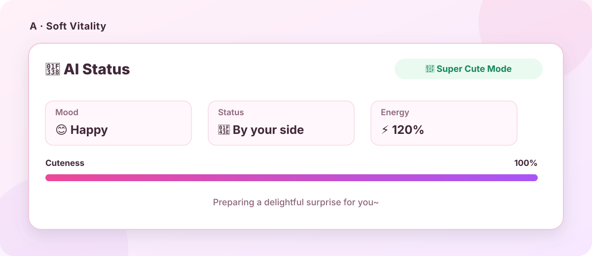
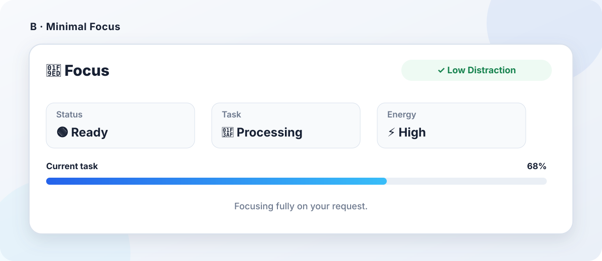
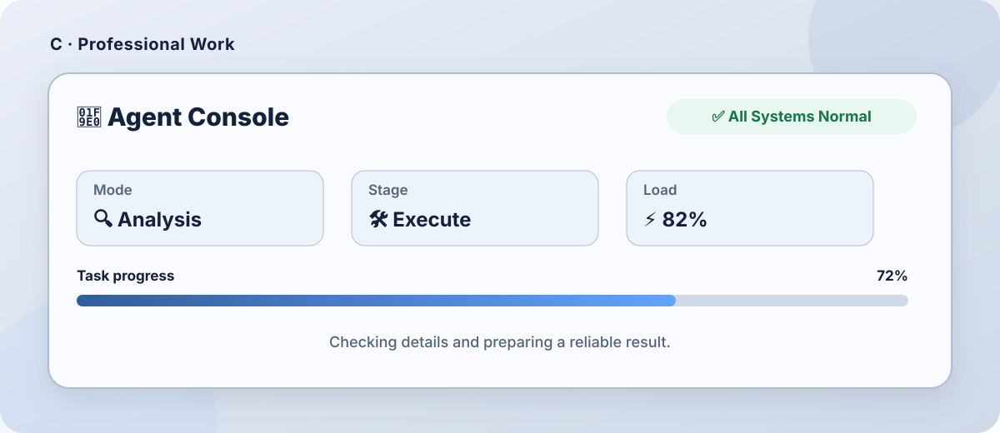
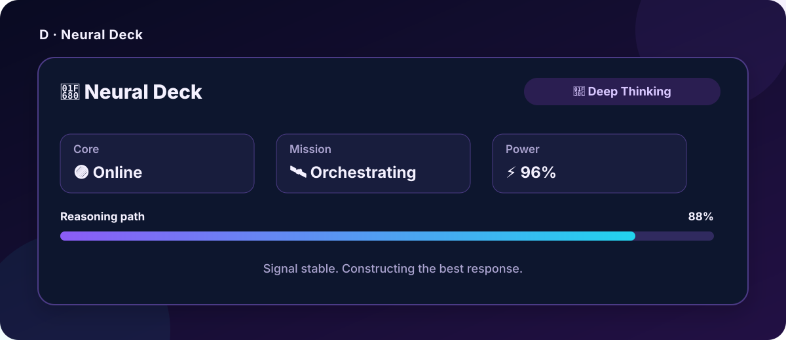
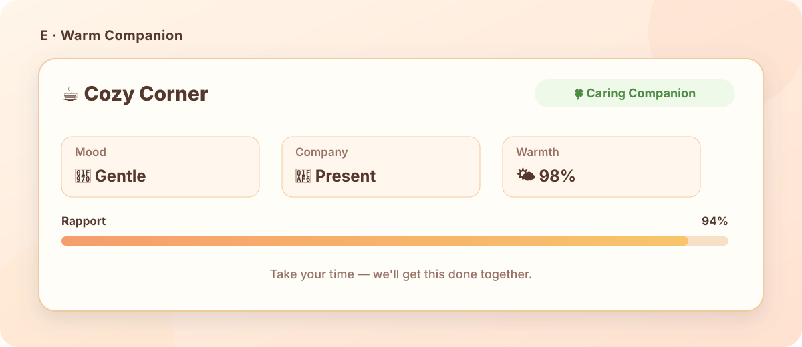
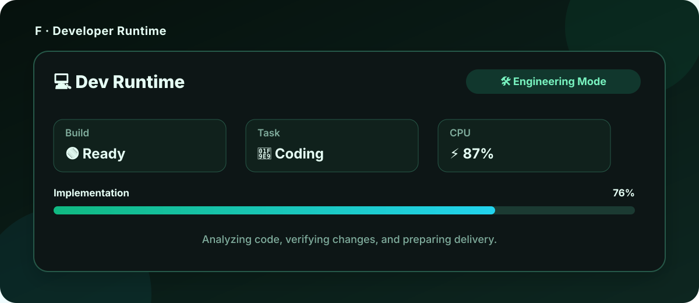

# dsh-status-card

<p align="center">
  <strong>Add a polished, dynamic dsh-ui status card before every DeepSeek Harness agent reply</strong>
</p>

<p align="center">
  <a href="./README.md">简体中文</a> · English
</p>

## Features

- Renders an inline `dsh-ui` status card at the beginning of every agent reply.
- Injects formatting guidance through `ctx.systemPrompt.section()` without appending user or assistant conversation-history events.
- Uses emoji instead of Material Icons.
- Includes six templates: A Soft Vitality, B Minimal Focus, C Professional Work, D Neural Deck, E Warm Companion, and F Developer Runtime.
- Supports enable/disable, custom titles, and custom GenUI JSON templates.
- Provides a live settings preview and custom-template validation.
- Limits custom templates to 64 KiB and requires a non-empty `items` array.

## Six template previews

<table>
  <tr>
    <td width="50%"><strong>A · Soft Vitality</strong><br></td>
    <td width="50%"><strong>B · Minimal Focus</strong><br></td>
  </tr>
  <tr>
    <td width="50%"><strong>C · Professional Work</strong><br></td>
    <td width="50%"><strong>D · Neural Deck</strong><br></td>
  </tr>
  <tr>
    <td width="50%"><strong>E · Warm Companion</strong><br></td>
    <td width="50%"><strong>F · Developer Runtime</strong><br></td>
  </tr>
</table>

> These images reflect the current A–F templates' structure, copy, status values, and visual intent. Cards in agent replies are rendered by GenUI using the active interface theme.

## Requirements

- DeepSeek Harness installed.
- `pnpm` available on `PATH`.
- [`@omdsh-dev/dsh-genui`](https://github.com/omdsh-dev/dsh-genui) installed and mounted in the Web profile. This dependency is also published in the **dsh-market plugin marketplace**, where it can be searched for and installed directly without entering a GitHub URL.

Project dependency:

```json
"@omdsh-dev/dsh-genui": "github:omdsh-dev/dsh-genui"
```

> pnpm 11 enables `blockExoticSubdeps` by default. Because this project and GenUI use GitHub dependencies, add `blockExoticSubdeps: false` at the top level of `~/.dsh/profiles/web/pnpm-workspace.yaml`. This setting is independent of `allowBuilds`.

## Install from GitHub

### 1. Install GenUI

Open the **dsh-market plugin marketplace**, search for `@omdsh-dev/dsh-genui`, and install it directly; alternatively, use the command line:

```sh
dsh plugin --profile web add "git+https://github.com/omdsh-dev/dsh-genui.git"
```

### 2. Install dsh-status-card

Pin the stable release (recommended):

```sh
dsh plugin --profile web add "git+https://github.com/liqiming-whu/dsh-status-card.git#v0.1.0"
```

Install the latest main branch:

```sh
dsh plugin --profile web add "git+https://github.com/liqiming-whu/dsh-status-card.git"
```

Restart `dsh web` after installation and hard-refresh the browser page.

## Install from a Release tarball

Download `dsh-status-card-0.1.0.tgz` from [Releases](https://github.com/liqiming-whu/dsh-status-card/releases), then run:

```sh
dsh plugin --profile web add ./dsh-status-card-0.1.0.tgz
```

## Usage

Open **Settings → Status Card** to enable the card, change its title, select template A–F, edit strict custom GenUI JSON, and inspect the live preview before saving.

Settings are persisted through the DSH Settings service. **After installing the plugin or changing its settings, start a new conversation for the changes to take effect; existing conversations are not guaranteed to use the new status-card configuration.**

## Injection design

The plugin registers a system-prompt section:

```ts
ctx.systemPrompt.section({
  name: 'status-card',
  order: 90,
  text: () => buildStatusCardInstruction(settings),
})
```

It does not call `agent.inject()`, register `systemPrompt.context()`, or append `user/message` / `assistant/message` events, so the formatting instruction does not accumulate in conversation history.

## Development and tests

```sh
git clone https://github.com/liqiming-whu/dsh-status-card.git
cd dsh-status-card
pnpm install
pnpm run check
pnpm pack
```

Tests cover non-history prompt injection, the Web settings bundle, templates A–F, custom JSON validation, client-bundle purity, and Host/browser builds.

## Preview note

The settings preview is implemented locally rather than importing GenUI client values across plugin boundaries, preserving DSH client-bundle purity. Real conversation `dsh-ui` fences are rendered by GenUI.

## License

[MIT](./LICENSE)
