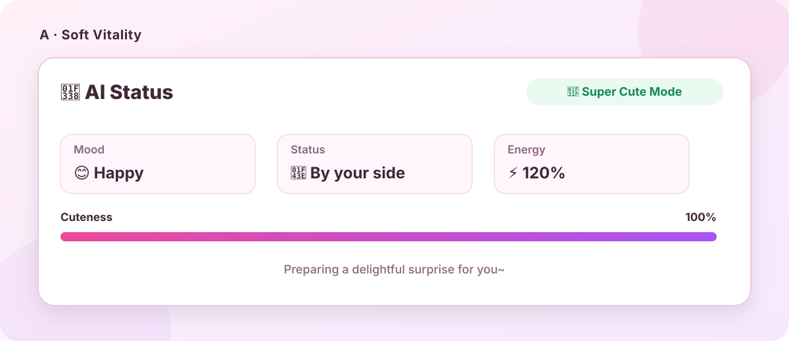
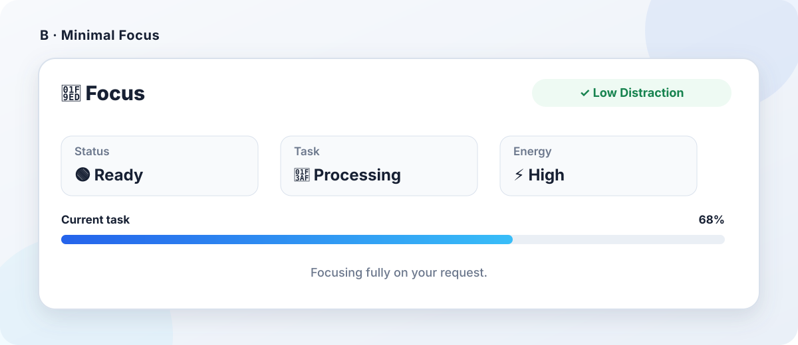
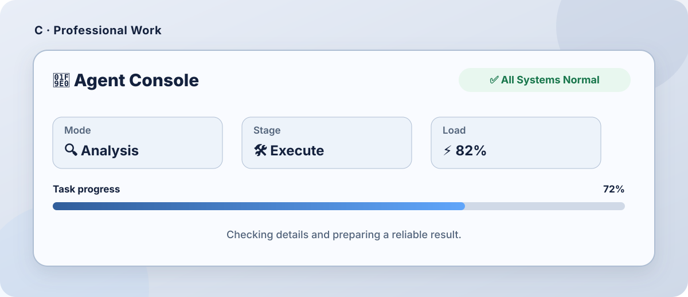
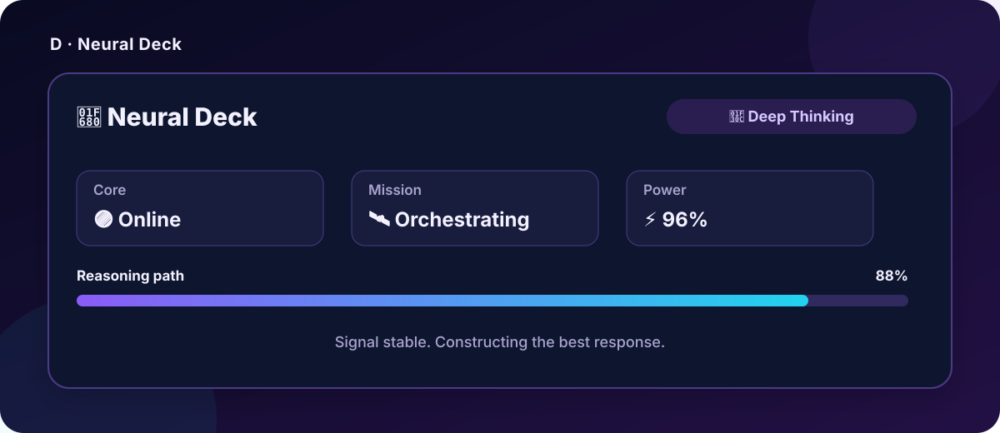
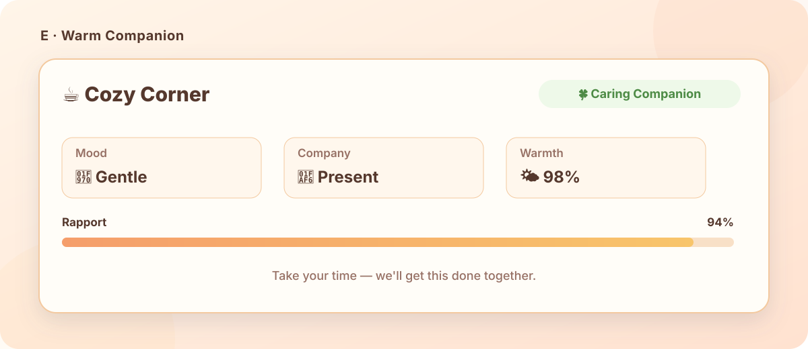
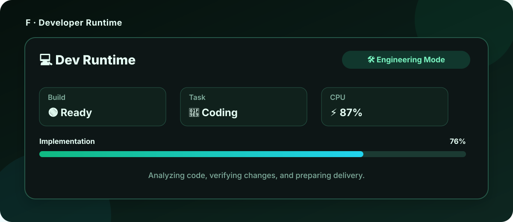

<h1 align="center">dsh-status-card</h1>

<p align="center">
  <strong>Add a polished, dynamic dsh-ui status card before every DeepSeek Harness agent reply</strong>
</p>

<p align="center">
  <a href="./README.md">简体中文</a> · English
</p>

## Features

- Renders an inline `dsh-ui` status card at the beginning of every agent reply.
- Injects formatting guidance through `ctx.systemPrompt.section()` without appending user or assistant conversation-history events.
- Uses emoji instead of Material Icons.
- Includes six templates: A Soft Vitality, B Minimal Focus, C Professional Work, D Neural Deck, E Warm Companion, and F Developer Runtime.
- Supports enable/disable, custom titles, and custom GenUI JSON templates.
- Provides a live settings preview and custom-template validation.
- Automatically detects the browser's preferred language: languages beginning with `zh` use Chinese for settings, built-in templates, and system-prompt injection; all other languages use English.
- Limits custom templates to 64 KiB and requires a non-empty `items` array.

## Six template previews

<table>
  <tr>
    <td width="50%"><strong>A · Soft Vitality</strong><br></td>
    <td width="50%"><strong>B · Minimal Focus</strong><br></td>
  </tr>
  <tr>
    <td width="50%"><strong>C · Professional Work</strong><br></td>
    <td width="50%"><strong>D · Neural Deck</strong><br></td>
  </tr>
  <tr>
    <td width="50%"><strong>E · Warm Companion</strong><br></td>
    <td width="50%"><strong>F · Developer Runtime</strong><br></td>
  </tr>
</table>

> These images reflect the current A–F templates' structure, copy, status values, and visual intent. Cards in agent replies are rendered by GenUI using the active interface theme.

## Requirements

- DeepSeek Harness **0.2.0-rc.2** installed. The upcoming plugin version **0.3.1** supports only this runtime version; compatibility with other versions is not claimed.
- `pnpm` available on `PATH`.
- `@changfenhuang/dsh-genui` (version **0.11.3** as actually installed on this machine) installed and enabled in the Web profile. The package name comes from the package actually installed locally; the source repository is still [omdsh-dev/dsh-genui](https://github.com/omdsh-dev/dsh-genui), but the name published to the registry and installed through the **dsh-market plugin marketplace** is `@changfenhuang/dsh-genui`. Install and enable it before installing this plugin.

This plugin's `dsh.client.inject` has been synchronized to the locally installed name `@changfenhuang/dsh-genui`. It uses GenUI through that injection but does not declare GenUI as a pnpm dependency. That keeps installation from resolving a transitive GitHub dependency; GenUI remains a required runtime prerequisite for rendering status-card fences.

> Without GenUI, the status-card formatting instruction is still injected, but `dsh-ui` fences in the conversation cannot render. Install and enable a GenUI version compatible with the current runtime first.

## Compatibility and release status

The local migration target is DSH **0.2.0-rc.2**. Plugin **0.3.1** is published: [Release v0.3.1](https://github.com/liqiming-whu/dsh-status-card/releases/tag/v0.3.1) provides `dsh-status-card-0.3.1.tgz` (plus `dsh-status-card.tgz` carrying the same bytes). It uses the new Config fields and ConfigForms interface rather than the old Settings API. GenUI must still be installed and enabled separately.

## 0.3.1 fix: read-only settings page

- **Symptom**: after installation, the "Enable reply status card" checkbox and the template dropdown in the settings page were all greyed out and could not be operated.
- **Root cause**: `customTemplate` previously used `z.transform`. DSH projects every volatile field into a serialized form schema for the browser (the host-side `plainSchema` does `new z(schema.toJSON())` and then `form.toJSON()` again); once the callback is revived through `new Function` it no longer carries `toJSON`, so the second serialization drops it entirely, the browser decode reports `callback is not a function`, that namespace snapshot never reaches ready, and the page becomes read-only.
- **Fix 1**: `customTemplate` is a plain `z.string()` again; validation of custom JSON now happens in the settings page `parseCustomTemplate` before saving, with a defensive fallback in the injection layer (an invalid template falls back to the bootstrap template and never breaks prompt injection).
- **Fix 2**: the client no longer uses "decode state ready" as its editability criterion and looks only at the snapshot's `writable` (always true for this entry on the host side), so a single field's decode failure can no longer lock the whole page.
- **Conclusion / rule**: do not use `z.transform` for volatile settings fields.
- **Fix 3 (template spacing)**: `row` nodes in the templates no longer carry `gap`. GenUI's `row` schema accepts only `items`/`wrap`/`spacer` and fixes row spacing at 12px (`--dsl-g-gap-md`; only `col` supports `gap`), so the previous `gap: 8` was silently ignored and produced an unknown-field warning. The settings-page preview now matches GenUI too: `row`/`grid` are fixed at 12px, `col` reads its own `gap`, and the spec root `gap` defaults to 16px.
- **Regression test**: the test calls `@deepseek-ai/dsh-settings`' own `volatileForm` / `projectForm` / `plainConfig` to reproduce the host projection, then decodes it the way the browser does and asserts that decoding succeeds; it also walks every built-in template and asserts that no `row` node carries a `gap`.

The fix requires reinstalling the plugin (download the Release asset, or run `pnpm pack` locally) and restarting `dsh web` / the desktop app plus a browser hard refresh; settings changes themselves still take effect immediately with no new conversation required.

## Installation (download from the Release)

### 1. Install GenUI

Open the **dsh-market plugin marketplace** and install the package name `@changfenhuang/dsh-genui`; alternatively, use the command line:

```sh
dsh plugin --profile web add @changfenhuang/dsh-genui
```

### 2. Install dsh-status-card

Download `dsh-status-card-0.3.1.tgz` from [Release v0.3.1](https://github.com/liqiming-whu/dsh-status-card/releases/tag/v0.3.1) and install it:

```sh
dsh plugin --profile web add ./dsh-status-card-0.3.1.tgz
```

The desktop app uses the profile name `desktop` (`web` for `dsh web`); replace `--profile` to match how you run DSH.

You can also build from the `v0.3.1` tag's source. It is the **same source** the Release asset was built from, but the tgz `pnpm pack` produces is not guaranteed to be byte-identical: with `core.autocrlf` in effect, checkout converts tracked text files to CRLF. The `lib/**` build outputs matched byte-for-byte only in this re-verification under the same toolchain; that is not a promise across Node/pnpm versions or platforms.

```sh
git clone https://github.com/liqiming-whu/dsh-status-card.git
cd dsh-status-card
git checkout v0.3.1
pnpm install
pnpm pack
dsh plugin --profile web add ./dsh-status-card-0.3.1.tgz
```

Restart `dsh web` or the desktop app after installation and hard-refresh the browser page.

## Historical versions

Existing historical Git tags include `v0.2.1`. That tag is not the `0.3.1` version for DSH `0.2.0-rc.2` and is not the recommended installation source for this runtime. Consult [Releases](https://github.com/liqiming-whu/dsh-status-card/releases) for the historical assets actually available.

## Usage

Open **Settings → Status Card** to enable the card, change its title, select template A–F, edit strict custom GenUI JSON, and inspect the live preview before saving.

The browser reads `navigator.languages` (falling back to `navigator.language`) and writes the detected locale to the plugin Config. Preferred languages beginning with `zh` select Chinese; every other language selects English. The settings UI switches immediately, and the matching system prompt and templates are used for subsequent model requests.

The Client uses ConfigForms from `@deepseek-ai/dsh-client-ui-settings/client` and retrieves the form through `ctx.configForms.get('status-card')`. Settings are persisted in the profile patch by plugin entry id, not in an independent Settings namespace.

**Settings changes and synchronized browser-locale changes take effect immediately on subsequent model requests, including in existing conversations; no new conversation is required.** Installing the plugin still requires restarting `dsh web` or the desktop app and hard-refreshing the browser. Previously generated replies are not changed retroactively.

## Injection design

The plugin registers a system-prompt section through `ctx.systemPrompt.section()`. Every user-setting field in Config is marked `.volatile()`. During each prompt assembly, the Host reads current values through `entry.field.get()` (`field` stands for the relevant setting field) and builds the status-card instruction instead of caching an installation-time configuration snapshot. `sectionOrder` remains a plain number rather than a volatile setting field.

### 0.2.0-rc.2 API migration

- Remove the old `installSettingsSection`, `settingsNamespace`, and `settingsScope`; manage settings through Config / ConfigForms.
- Replace the old `dsh-client-runtime` / `web-react` usage: the Client Context type comes from `@deepseek-ai/cordis` (peer `~4.0.4`), and the type-only import `import type {} from '@deepseek-ai/dsh-client-ui-renderer/client'` provides slots Service declaration augmentation. Do not use a side-effect import, which would leave a prohibited cross-plugin runtime require in the browser bundle.
- The `ConfigForm` type comes from `@deepseek-ai/dsh-client-ui-settings/client`; corresponding DSH dependencies use the exact version `0.2.0-rc.2`.

It does not call `agent.inject()`, register `systemPrompt.context()`, or append `user/message` / `assistant/message` events, so the formatting instruction does not accumulate in conversation history.

## Development and tests

```sh
git clone https://github.com/liqiming-whu/dsh-status-card.git
cd dsh-status-card
pnpm install
pnpm run check
pnpm pack
```

Tests cover non-history prompt injection, the Web settings bundle, the host projection and browser decode regression for volatile fields (`volatileForm` / `projectForm` / `plainConfig`), templates A–F, custom JSON validation, client-bundle purity, and Host/browser builds.

## Preview note

The settings preview is implemented locally rather than importing GenUI client values across plugin boundaries, preserving DSH client-bundle purity. Real conversation `dsh-ui` fences are rendered by GenUI.

## License

[MIT](./LICENSE)
